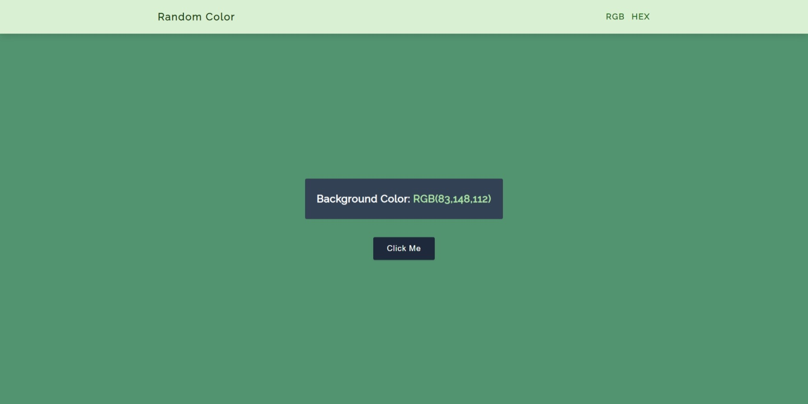
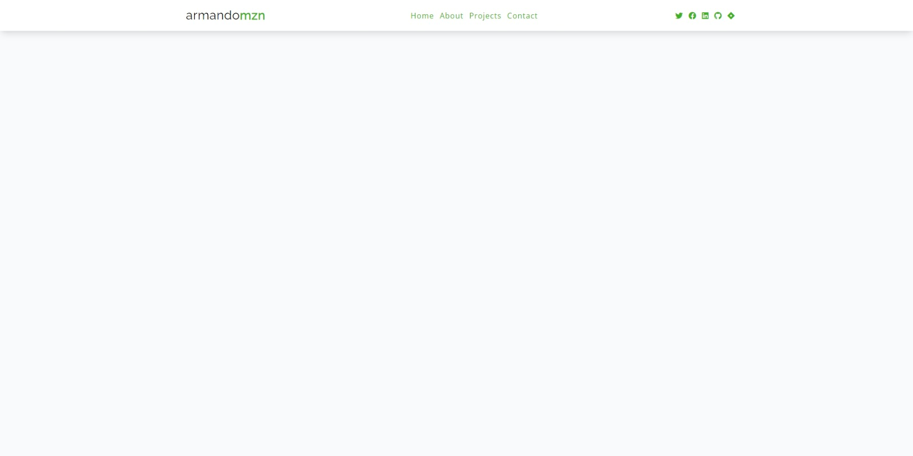
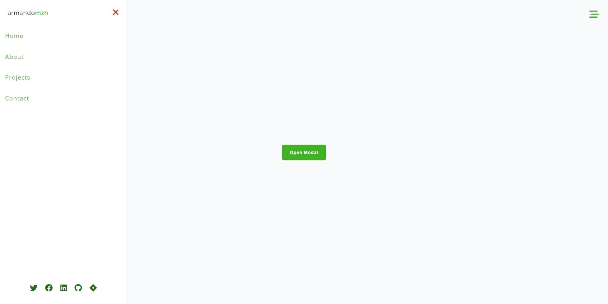
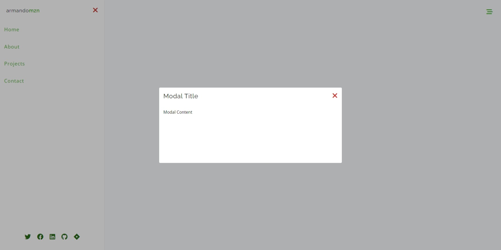
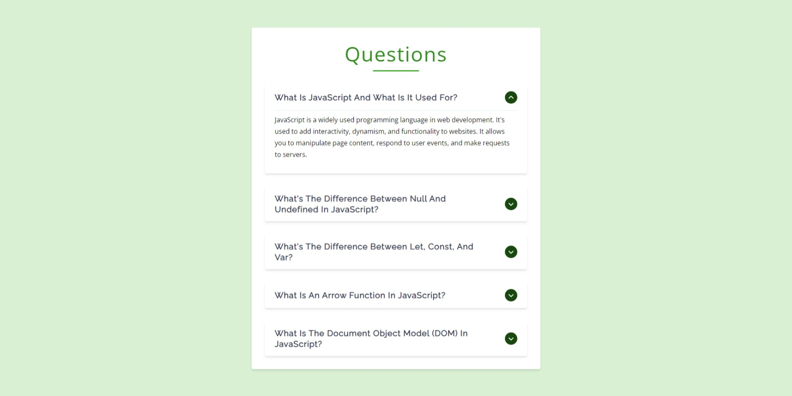
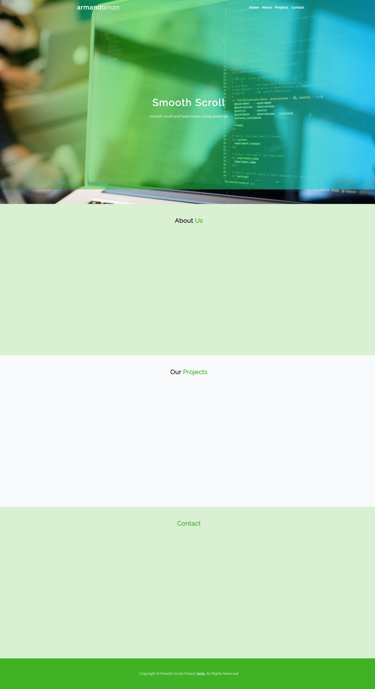
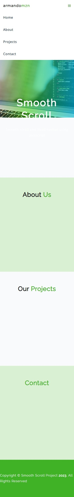
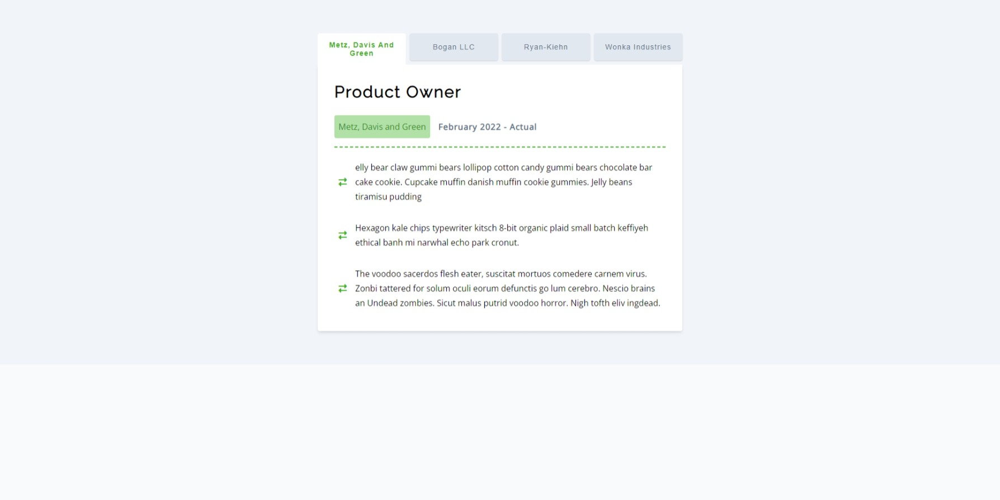
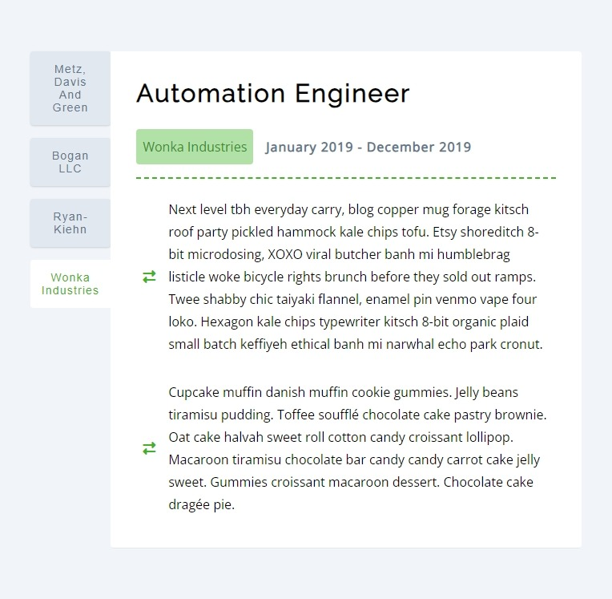
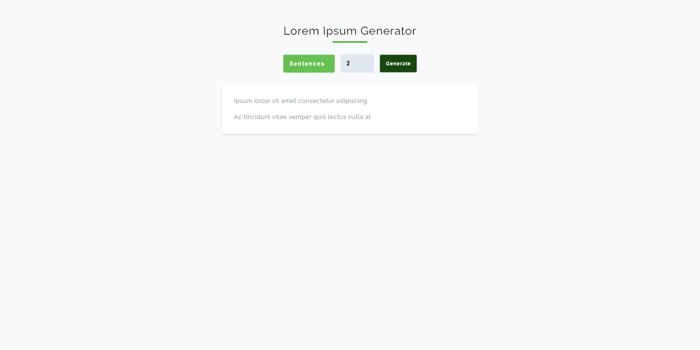

## Random Color Generator

## Live Example

- [Random color generator using recursion for rgb and hex colors](https://charming-clafoutis-767e43.netlify.app/)

## Reviews

## Live Example

- [Reviews with index handling](https://polite-cendol-435002.netlify.app/)

## Navbar

## Live Example

- [Responsive navbar that dynamically adjusts the navigation links that are provided](https://funny-sawine-3c5025.netlify.app/)

## Sidebar Modal

## Live Example

- [Sidebar and modal](https://celebrated-gelato-467006.netlify.app/)

## Modal

## Live Example

- [Modal](https://boisterous-tapioca-5dc5a2.netlify.app/)

## Accordion

## Live Example

- [Accordion opening only one element](https://unique-truffle-f87e44.netlify.app/)

## Menu

## Live Example

- [Menu filtering categories from a dataset](https://steady-croquembouche-94a78d.netlify.app/)

## Smooth Scroll

## Live Example

- [Smooth scrolling with javascript calculating the height of the sections with getboundingclientrect function and fixed menu](https://loquacious-shortbread-b3b333.netlify.app/)

## Tabs

## Live Example

- [Tabs project where the data is injected through js and we search for the element through id](https://capable-strudel-b888ee.netlify.app/)

## Countdown

## Live Example

- [Countdown project where the count is updated every 7 days after the page is restarted.](https://gorgeous-frangipane-7ae5db.netlify.app/)

## Lorem Ipsum

## Live Example

- [Dynamic lorem ipsum generator using forms](https://adorable-capybara-f08381.netlify.app/)
