## Random Color Generator

## Live Example

- [Random color generator using recursion for rgb and hex colors](https://charming-clafoutis-767e43.netlify.app/)

## Reviews

## Live Example

- [Reviews with index handling](https://polite-cendol-435002.netlify.app/)

## Navbar

## Live Example

- [Responsive navbar that dynamically adjusts the navigation links that are provided](https://funny-sawine-3c5025.netlify.app/)

## Sidebar Modal

## Live Example

- [Sidebar and modal](https://celebrated-gelato-467006.netlify.app/)

## Modal

## Live Example

- [Modal](https://boisterous-tapioca-5dc5a2.netlify.app/)

## Accordion

## Live Example

- [Accordion opening only one element](https://unique-truffle-f87e44.netlify.app/)

## Menu

## Live Example

- [Menu filtering categories from a dataset](https://steady-croquembouche-94a78d.netlify.app/)

## Smooth Scroll

## Live Example

- [Smooth scrolling with javascript calculating the height of the sections with getboundingclientrect function and fixed menu](https://loquacious-shortbread-b3b333.netlify.app/)

## Tabs

## Live Example

- [Tabs project where the data is injected through js and we search for the element through id](https://capable-strudel-b888ee.netlify.app/)

## Countdown

## Live Example

- [Countdown project where the count is updated every 7 days after the page is restarted.](https://gorgeous-frangipane-7ae5db.netlify.app/)

## Lorem Ipsum

## Live Example

- [Dynamic lorem ipsum generator using forms](https://adorable-capybara-f08381.netlify.app/)

## Task Manager

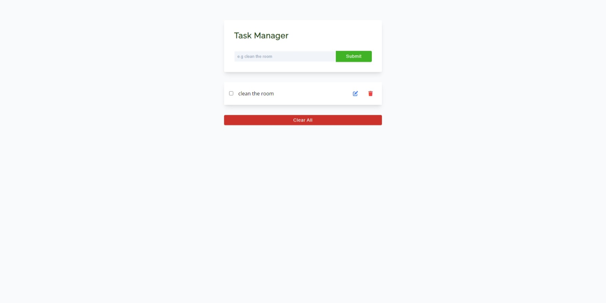

## Live Example

- [Task manager using local storage](https://eloquent-cassata-5ab73c.netlify.app/)

## Slider

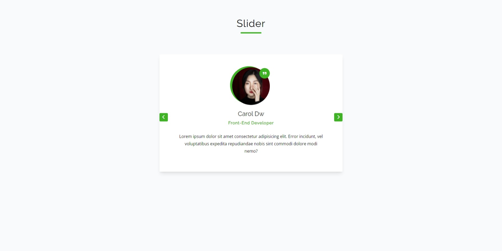

## Live Example

- [Slider modifying properties in the dom to update the current element](https://incandescent-gumption-a0779c.netlify.app/)

## Gallery

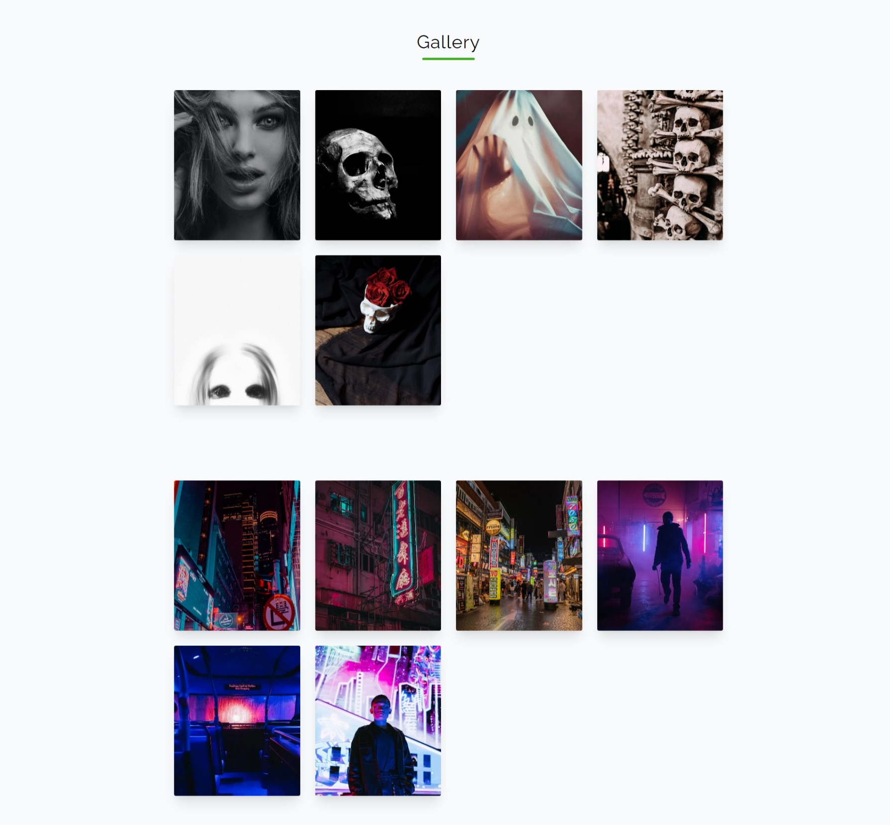

## Live Example

- [Gallery using a class to manage the state of the elements](https://cheery-moonbeam-293c01.netlify.app/)

## Random Numbers

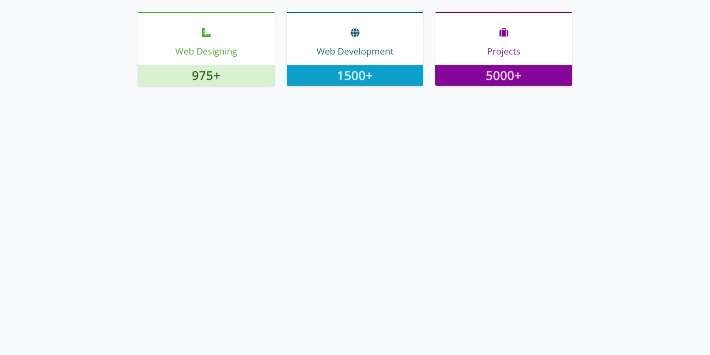

## Live Example

- [Random numbers using interval and updating each element in the dom](https://visionary-daffodil-6943e6.netlify.app/)

## Dark Mode

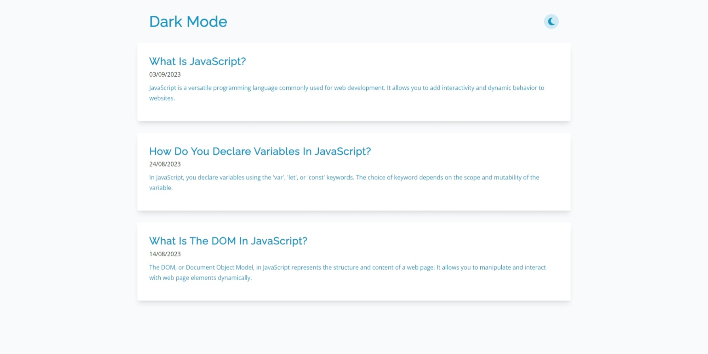

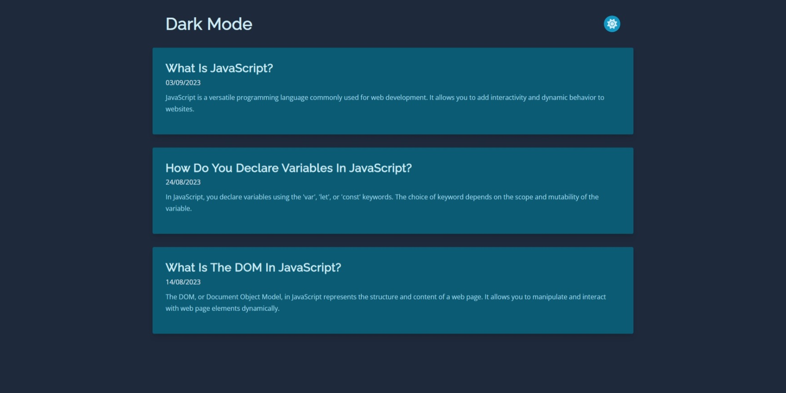

## Live Example

- [Dark mode using css variables to change the colors](https://relaxed-gumdrop-88c9b6.netlify.app/)

## Filters

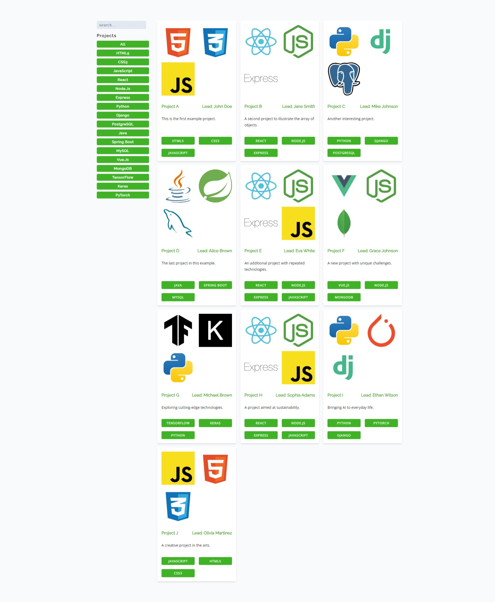

## Live Example

- [Application using filters with ES6 methods](https://earnest-sfogliatella-bdd278.netlify.app/)

## Norris Jokes

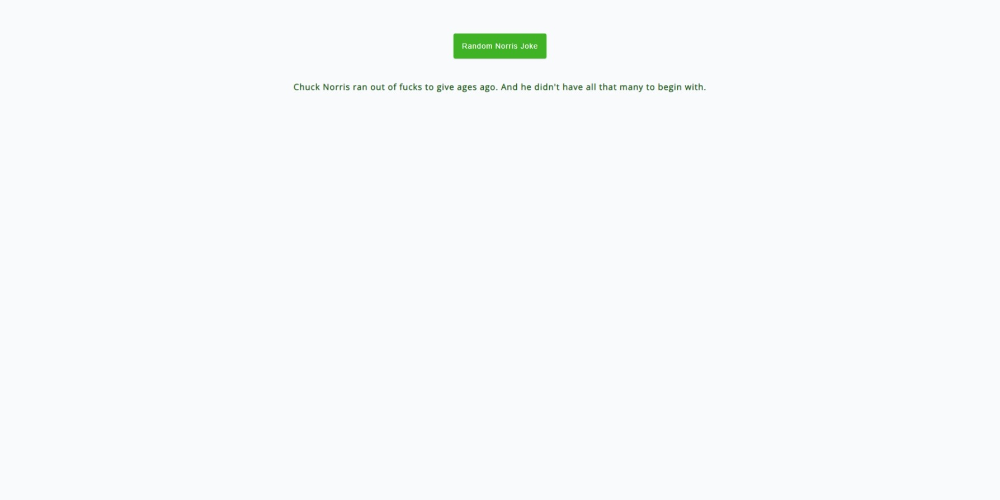

## Live Example

- [Application using chuck norris api to fetch some joke](https://starlit-melomakarona-6ce20c.netlify.app/)

## Random Users API

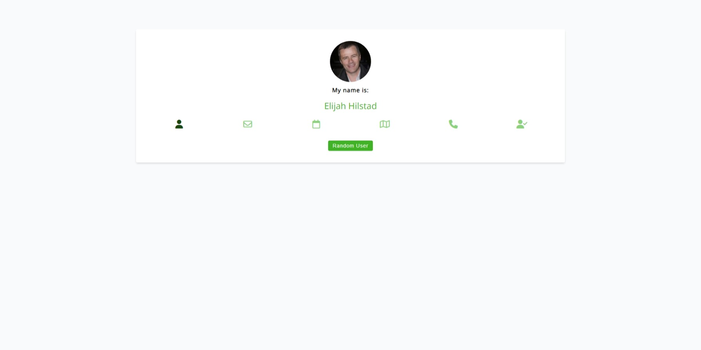

## Live Example

- [Fetching data from random user api](https://shiny-paprenjak-dd71ec.netlify.app/)

## Cocktail API

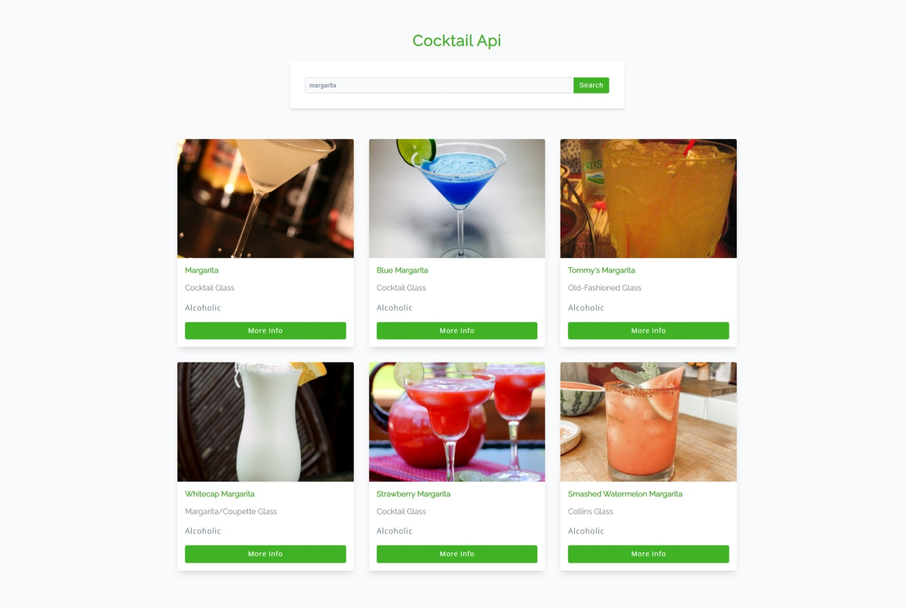

## Live Example

- [Fetching data from cocktail api and searching cocktails given the endpoint](https://main--subtle-wisp-0dfd74.netlify.app/)

## Strapi Menu

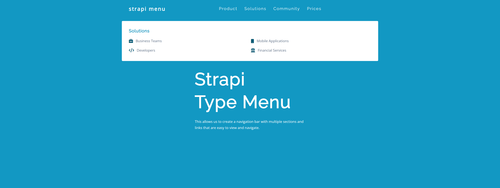
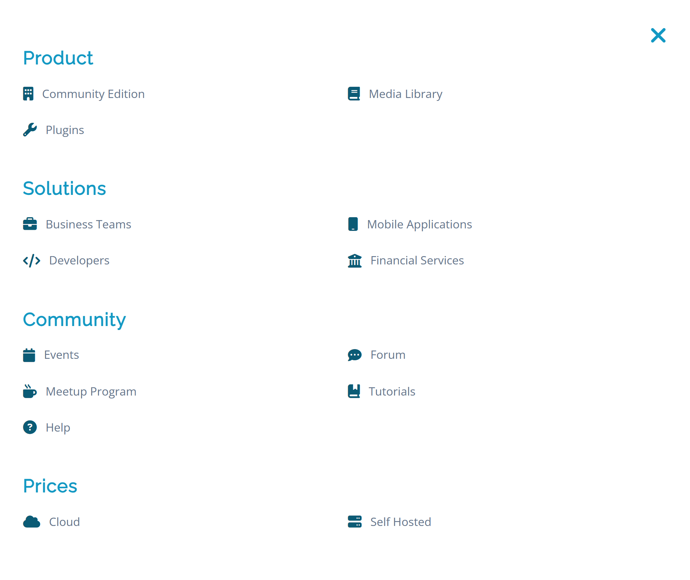

## Live Example

- [Strapi type menu using mouse events to handle the submenus and adding sidebar for small devices](https://animated-sunburst-47a37e.netlify.app/)
